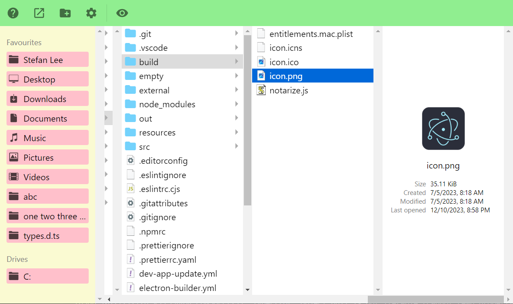

# purpl-electron-react-vite \[WIP\]

A Windows File Explorer application built using Electron that was inspired by macOS Finder's column view.



## Features

- File Explorer with column view
- Arrow key navigation
  - ↑ / ↓ : select item
  - ← : navigate up to parent folder
  - → : navigate into folder (if selected item is a folder)
- Integration with [QuickLook](https://github.com/QL-Win/QuickLook)
  - Press `space` to toggle
- Generate thumbnails / file icons using native Windows APIs via my other Nodejs addon [`win-thumbnail`](https://github.com/rexcyrio/win-thumbnail)

## Recommended IDE Setup

- [VSCode](https://code.visualstudio.com/) + [ESLint](https://marketplace.visualstudio.com/items?itemName=dbaeumer.vscode-eslint) + [Prettier](https://marketplace.visualstudio.com/items?itemName=esbenp.prettier-vscode)

## Project Setup

### Install

```bash
npm install
```

### Development

```bash
npm run dev
```

### Build

```bash
# For windows
$ npm run build:win

# For macOS
$ npm run build:mac

# For Linux
$ npm run build:linux
```

## Acknowledgements

Project template referenced from [https://github.com/alex8088/quick-start/tree/master/packages/create-electron/playground/react-ts](https://github.com/alex8088/quick-start/tree/master/packages/create-electron/playground/react-ts)
